# 2023.11.14
1.顶点一定在边上，所以即便有无穷多最优解（可行边），那也一定存在顶点是最优解，因此最优解不一定是基可行解（基解、基最优解），
因为它不一定是基得来，可能在边上。如果最优解是有限的，那就不存在最优边，就一一对应了。

2.一般线性规划的标准型要求右端项大于等于0，且自变量范围大于0，还有变量数目大于等于约束数目

3.基变量是线性无关的几个变量，非基变量是除了基变量的变量，例如
$$
\begin{aligned}
&max\ \ z=2x_1+1x_2+3x_3\\
&x_1-x_3+x_4=5\\
&2x_1+x_2+x_3+x_5=6\\
&x_2+2x_3+x_6=7\\
\end{aligned}
$$
其中，系数矩阵为
$$
\begin{bmatrix}
1&0&-1&1&0&0\\
2&1&1&0&1&0\\
0&1&2&0&0&1\\
\end{bmatrix}
$$
基变量可以为除了$(x_2,x_5,x_6)$之外的所有组合。除了基变量之外的非基变量，在计算初始解时均为0，如令$(x_4,x_5,x_6)$为基变量,
则$(x_1,x_2,x_3)$为非基变量，即$(x_1,x_2,x_3)$为0，继而解方程计算$(x_4,x_5,x_6)$的取值。
基变量之间是线性无关的

4.每一次迭代，都是从一个顶点过渡到其相邻的顶点，其原理是，在迭代中，只有一个变量进基，1个变量出基，所以其余变量的取值是不变的，只有这两个变量的取值会发生变化，这里cue一下相邻的定义：说两个顶点是相邻的，是因为它们之间可以通过一次基变换直接转换，在几何上就是它们可以通过一条边直接连接

5.一般要求m\*n(m变量,n约束)的问题，m要大于等于n，其m\*n阶的系数矩阵的秩是n，其中任意一个n\*n的满秩子矩阵A都是系数矩阵的一个基，也称B为非奇异子矩阵，即B的行列式不为0（这里与基变量线性无关对应）

6.如果约束都是等号，且约束个数大于变量个数，根据克拉默法则，就一定有唯一解，且存在(n-m)个冗余约束。如果不全是等号，那就可以构造人工变量了。

7.还有一种情况，虽然变量个数大于约束个数，但是约束都是等号，不能加入松弛变量，那就需要使用两阶段法。第一阶段往每条约束里强行插入一个新变量，构成初始基，之后最小化插入的变量，使其取其下界0，这样的话就相当于没有插入，最后得到其余原先变量的初始解，再代入原来的数学模型里二阶段求解。
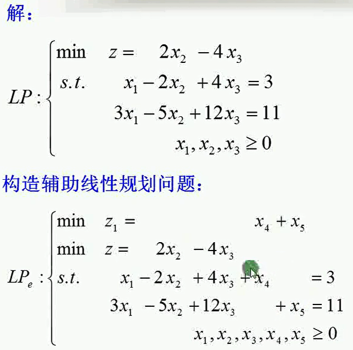
8.松弛变量是为了将小于等于不等式约束转换成等式约束而添加的变量；剩余变量是为了将大于等于不等式转为等式而添加的变量；人工变量是为了构成初始基，强行在等式里加入的变量

9.大M法是在大于等于约束的时候，减去一个剩余变量，还不能构成单位矩阵，所以还需要加上人工变量。加上人工变量后人工变量构成单位矩阵，之后将人工变量乘以大M体现在目标函数中

10.构造的人工变量、松弛变量作为初始基时，方程组是一定有解的，因为其他非基变量均为0，此时的基变量直接就等于右端项，故而有解（右端项非负，如果是负就处理成非负），因此初始基可以进行迭代，所以大M法可以直接以M为惩罚项就去迭代。

11.如果是≥的形式，转换成标准型的时候，需要减去一个剩余变量，这时候变成等式。但是这个剩余变量的系数是-1，还不能构成单位矩阵，因此要么乘以-1，要么添加人工变量。如果乘以-1，此时右端项b原先是正，现在变成了负，那就不是标准型了（如果原先b是负，乘以-1就变成正了，就不用下面工作，可以直接进行迭代）。因为不能构成标准型了，所以还需要添加一个人工变量，这个人工变量因为是强行添加进去的，所以取值需要是0，继而使用大M法或者两阶段法。

12.两阶段法中，最后的非基变量一定不会是人工变量，因为人工变量需要是非基变量才能取值为0，在此情况下，一定有m（m为约束个数）个基变量，这m个基变量为原始决策变量或者是剩余变量，而不可能是人工变量。因此第一阶段求完初始解后，就可以在此基变量（单位矩阵）的基础上，进行第二轮迭代。

13.也有一种可能，原右端项为0，因此第一阶段人工变量可以为基变量，直接取值为0，但是这种情况不会发生，因为第一阶段人工变量的ci为1（min），那么它就会被换出，尽管换入的变量的θ都为0，也不影响人工变量会被换出

14.两阶段法就是把大M惩罚项拆解开了，先在第一阶段求得人工变量为0下的决策变量的取值，这个值在z为0时一定是可行解（z不为0代表人工变量不为0，即原约束等号不成立，即原问题无解）
# 2023.11.30
## 1.分支定界法
    1.在求解整数规划时，先求其松弛问题（放弃整数约束）的最优解
    2.在这个最优解的基础上，进行分枝剪枝，如果存在$x=2.4$，那就将问题分为$x\leq 2$与$x\geq 2$这两个子问题，求解这两个问题，并记录每个问题的最优解
    3.如果出现符合原题的整数解，则标记此整数解为下界（松弛问题为上界）
    4.如果当前存在下界，且一个分支的目标函数值差于当前下界，就放弃这个分支
    5.如果当前存在下界，且分支的目标函数值不差于当前下界，那就继续分支
    6.如果当前不存在下界，且两个分支都没求出符合题意的整数解，就都保留，继续分支
    7.如果一个分支全为整数解，且其他分支要么不可行，要么被剪枝，那么当前分支即为整数解
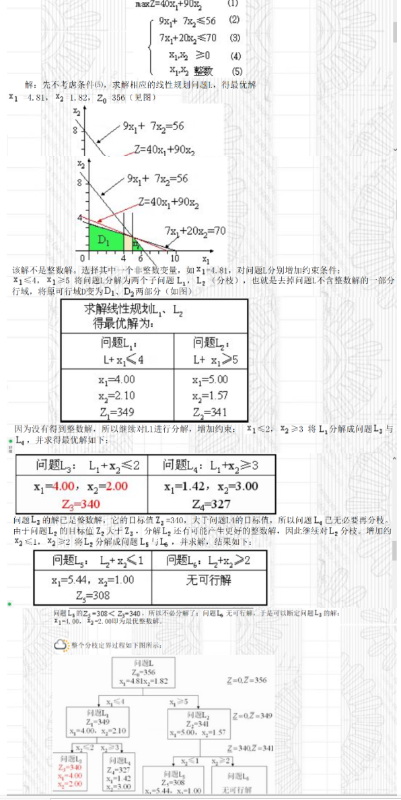
**总结就是，松弛问题都比不上当前分支的全整数可行解，那这个松弛问题分支就得被剪掉，没有继续研究的必要了**
# 2023.12.4
## 单纯形法
1.对于标准型（最大化）问题，取最优需要所有非基变量检验数都小于等于0，并且所有基变量检验数都等于0，检验数的开始值为目标函数的C，之后每次迭代随行变换变化。
2.在每次迭代的时候，选入基变量，选择标准是检验数最小的（负值），其实际含义为减少1个其会使目标函数上升检验数这么大，即上升最快。
3.出基变量为当前右端项除以aik（xk为入基变量）的最小值（非负）。因为θ的值实际上代表了入基变量增加的最大量，而不会破坏其他基变量（约束）的非负性。如果我们选择θ大的基变量作为出基变量，那么可能会导致其他基变量变为负数，从而破坏解的可行性。
4.选定进出基变量之后，更新单纯形表，令入基变量列为单位矩阵的列，即该行除以aik，aik变为了1，其余行减去ajk*aij/aik，检验数也是如此更新。
5.选取的xk的时候，一定要有aik是正的，因为如果所有的aik都是负的，且右端项是正的，那么xk的取值就都是无界的，目标函数也就无界了
6.每次单纯形表更新，就对应一个新的问题，因此各个数据都会相应地发生变化
## 检验数的实际意义
1.检验数的计算公式是$\sigma_j=c_j-\sum_{i\in x_B}^{n}c_ia_{ij},\forall j\in x_N$，其意义是，增加1个单位的$x_j$，会使每个约束里的其余基变量减少$a_{ij}$个单位，因此会使目标函数减少$c_ia_{ij}$，之后加和。如果增加1个单位的$x_j$增加的收益比这所有减少的收益还要多，那就说明可以增加$x_j$
2.如果某个变量的检验数大于0，但是其列向量均小于0，就代表可以无限制地增加这个变量，那么目标函数也会无限制地增加，问题无界解
3.最优解的基变量的检验数均需要为0，如果存在非基变量的检验数为0，说明存在无穷多最优解，这个非基变量无论取何值都不会影响其他变量的取值，也不会影响最优解的值
4.如果存在最优解，则最优解中的基变量的检验数均为0
## 退化
在线性规划的单纯形法中，当我们在确定换入基变量时，计算出的θ出现两个或两个以上相等的最小值时，称这种情况为退化。
1.具体来说，退化解主要有以下两种情况：
**基本可行解中的基变量等于零**：在单纯形表中，基变量$x_B=B^{-1}b-B^ {-1}Nx_N$。如果基可行解中出现一个或多个基变量等于零,$b=0$,即$B^{-1}b=0$，为了保证基变量非负（即$x_B \geq 0$），需要使$B^ {-1}Nx_N$为0，即无法改变目标函数值$f(x)=c_BB^{-1}b+(c_N-c_BB^{-1}N)x_N$。
**最小比值原则确定换出基的变量时，存在两个以上相同最小比值**：在确定换出基的变量时，如果存在两个以上相同最小比值，也称这种情况为退化。这种情况下，可能会在这两个变量之间连续迭代，也可能算法迭代一段时间后，这两个变量又产生进基和出基，无法改变目标函数值。
2.退化解的出现通常是由于模型中存在多余的约束。几何上，退化解就是两个或多个极点重合。
3.如果在最终表中原问题的解为非退化最优解，而其对偶问题的最优解为退化解，则原问题一定有无穷多个最优解
4.退化可能与无穷多最优解同时出现，但并不互相是充分条件或者必要条件。
## 对偶理论
1.max问题的变量符号与min问题的约束符号是相同的，其余都是相反的
2.原问题的最优解等于对偶问题的最优解（值）
3.原问题的无解可能是对偶问题的无界解或者是无可行解造成的
4.原问题的无界解是由对偶问题的无可行解造成的
## 对偶单纯形法
### 要点
    1.原问题如果约束少，但是变量很多，这时候可以使用对偶单纯形法。这是因为原问题转化为对偶问题后，原来的约束变成了新问题的变量，
    原来的变量变成了新问题的约束，由于变量的数量减少，每次迭代需要处理的数据量也相应减少，从而可以减少计算量。
    2.对偶单纯形法不要求对偶问题的初始解是可行解，因为初始的松弛变量等于右端项，可以为负
    3.在使用对偶单纯形法时，要求必须目标函数里的系数都为正，且右端项中必须有负分量，而大多数线性规划问题的初始单纯形表很难满足要求，
    因此，对偶单纯形法一般不会单独使用。而使用单纯形法时，标准形式的约束要求右端项b必须不能有负分量，因为在标准形式里，资源不能是负的
    4.由于对偶单纯形法允许右端项为负数，因此就没有剩余变量这个概念了，可以化为>=后减去剩余变量
    5.对偶单纯形法使用时，如果已经转换成max，则需要目标函数均为负
### 流程
1.根据松弛变量当做初始基开始迭代，要求此时所有目标函数的价值系数都为非负，b里有负分量
2.确定出基变量（单纯形法先确定的是入基变量），出基变量为bi最小的行对应的基变量
3.可行性检验，如果对于出基变量这一行r，所有的ari都为正，即没有系数为负，那就无解
4.如果不满足3，就确定入基变量，入基变量为ck/ark最小的列对应的变量（要求ck和ark均为负），ck就是当前单纯形表的目标函数系数
5.更新单纯形表
6.与单纯形法相同，若所有变量检验数均非正（这也要求对偶单纯形法的目标函数是max），则最优
## 修正单纯形法
### 1.概述
修正单纯形法的一个关键思想就是保留基变量的逆矩阵，这样在需要入基变量时，可以直接使用这个逆矩阵来计算新的基变量的系数。这是因为基变量的逆矩阵实际上已经包含了转轴变换的信息，所以我们可以直接使用它来计算新的基变量的系数，而不需要对非基变量的系数矩阵进行任何改变。这种方法大大提高了计算效率，因为我们不需要在每次迭代时都重新计算整个系数矩阵。
### 2.具体步骤
2.1标准化
2.2获取基变量
2.3非基变量的下降向量$\bar{c}^T_N=c^T_BB^{-1}N-c^T_N$,其中第$j$个非基变量的可使目标函数下降值$\bar{c}_j=c^T_BB^{-1}a_j-c_j$
2.4在每次迭代时，对偶解$u^T=c^T_BB^{-1}$
2.5选取的入基变量的系数列向量为（因为修正单纯形法只会保留基变量的系数矩阵，非基变量的系数矩阵是在每次迭代时根据原始系数列向量与当前基变量的系数矩阵的逆矩阵的乘积运算得来的）$\bar{a}_j=B^{-1}a_j$，同理，所有得基变量的系数矩阵为$\bar{A}_N=B^{-1}N$，由于每次迭代我们只需要一个入基的非基变量，所以不需要全部计算系数矩阵，只需要知道怎么计算系数矩阵即可。
2.6当前迭代的目标函数值为$z=c^T_BB^{-1}b=c^T_B\bar{b}$
2.7选择$\bar{c}_j$最小的当做入基变量，因为他是目标函数下降最快，拿去它使目标函数增长最快
2.8选择出基变量，选择标准还是$r=\{i:min_i(\frac{\bar{b}_i}{\bar{a}_{ik}},\bar{a}_{ik}>0)\}$
2.9更新系数矩阵，返回2.3
2.10如果在某次迭代时，发现$\bar{c}^T_N$均为正，也就是说没有非基变量可以使目标函数下降了，即求得最优解，迭代结束
### 3.例题
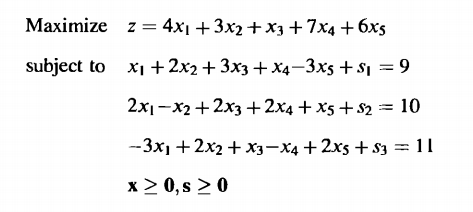
#### 0.初始化
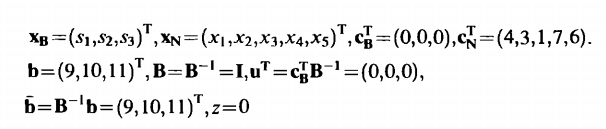
#### 1.迭代1
$$
\bar{c}^T_N=c^T_BB^{-1}N-C^T_N\\
\bar{c}^T_N=u^TN-c^T_N\\
\bar{c}^T_N=(0,0,0)\begin{bmatrix}
1&2&3&1&-3\\
2&-1&2&2&1\\
-3&2&1&-1&2\\
\end{bmatrix}-(4,3,1,7,6)\\
\bar{c}^T_N=(-4,-3,-1,-7,-6)\\
$$
选择$x_4$当做入基变量，因为他等于-7
$$
a_4=B^{-1}a_4
a_4=\begin{bmatrix}
    1&0&0\\
    0&1&0\\
    0&0&1
\end{bmatrix}
\begin{bmatrix}
    1\\
    2\\
    -1
\end{bmatrix}
a_4=\begin{bmatrix}
    1\\
    2\\
    -1
\end{bmatrix}
$$
即
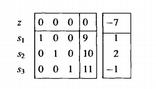
将$\bar{a}_4$转换成单位向量，即
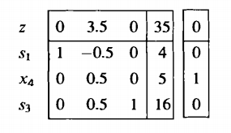
迭代1结束
#### 2.迭代2
$u^T=(0,3.5,0)$，也就是当前单纯形表问题的目标函数
$$
\bar{c}^T_N=c^T_BB^{-1}N-C^T_N\\
\bar{c}^T_N=u^TN-c^T_N\\
\bar{c}^T_N=(0,3.5,0)\begin{bmatrix}
1&2&3&1&-3&1&0&0\\
2&-1&2&2&1&0&1&0\\
-3&2&1&-1&2&0&0&1\\
\end{bmatrix}-(4,3,1,7,6,0,0,0)\\
\bar{c}^T_N=(7,-3.5,7,7,3.5,0,3.5,0)-(4,3,1,7,6,0,0,0)\\
\bar{c}^T_N=(3,-6.5,6,0,-2.5,0,3.5,0)\\
$$
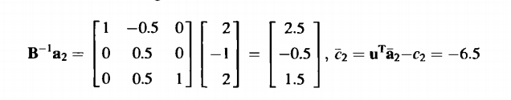
因此$x_2$入基
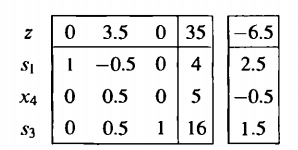
因此$s_1$出基
即
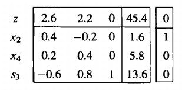
#### 3.循环迭代
一直到$\bar{c}^T_N$没有负项
#### 4.规律总结
可以看出，单纯形表里的z行，也就是目标函数行或者说是$u^T$一直代表的是松弛变量$s_1,s_2,s_3$，其他来个变量，它的那一列也只是加在单纯形表后面，用使新加列变为单位向量的行变化改变松弛变量的系数矩阵与$u^T$，$u^T$也可以认为是检验数，当前目标函数系数

# 2023.12.6
## 1.分数割平面法
### 1.1步骤
1.1.1化为标准型
1.1.2将约束全部转换成整数（系数是分数就通分）
1.1.3单纯形法迭代获得最优解
1.1.4选择当前单纯形表中，基变量小数部分最大的那个变量的那一行，把那一行化为
**（整数系数x变量-整数资源系数）+小数系数x变量=小数资源系数**
的形式，其中分数化为整数和小数时，整数部分为向下取整，小数部分为该数减去整数部分
1.1.5由于小数部分是一个数减去其向下取整得来的，因此小数部分的系数一定是大于等于0 ，且变量也大于等于0，因此整个小数部分大于等于0
因此有
**小数资源系数-小数部分<=小数资源部分<=1**
要想减去这部分小数，就需要令
**小数资源系数-小数部分<=0**
即
**小数部分<=小数资源系数**
1.1.6针对1.1.5最后生成的新的约束，添加到当前的单纯形表中，继续迭代
1.1.7重复割平面操作，直到满足所有整数解要求或者不可行
### 1.2例题
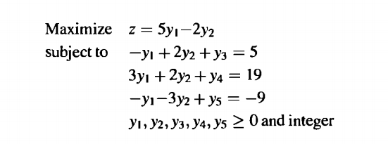
其中，松弛问题的最优单纯形表为
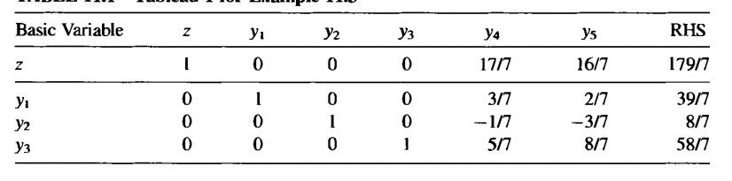
1.2.1 $y_1$可以分为5+4/7，比$y_2,y_3$的小数部分都大，所以选择$y_1$这一行，故有
$y_1+0y_2+0y_3+\frac{3}{7}y_4+\frac{2}{7}y_5=\frac{39}{7}$
拆解为
$(y_1-5)+\frac{3}{7}y_4+\frac{2}{7}y_5=\frac{4}{7}$
故可以添加约束:
$-\frac{3}{7}y_4+-\frac{2}{7}y_5\leq -\frac{4}{7}$
1.2.2新的单纯形表为
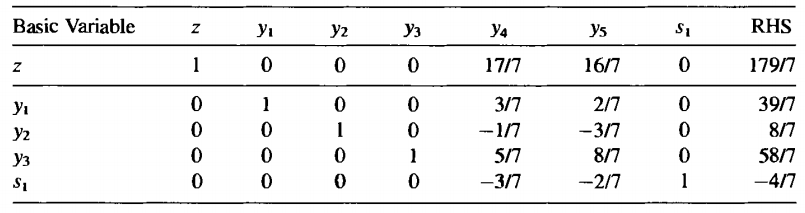
1.2.3迭代最优为：
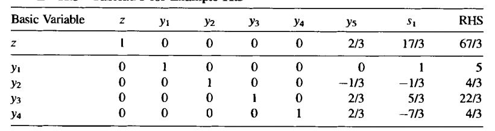
1.2.4重复1.2.1-1.2.3直到满足所有整数约束，即为最优解。因为再继续添加约束，解的质量一定不会高于当前解，当前解相当于之后解的松弛解，故直接输出最优解。或者发现不可行
### 1.3证明
$$
x_r+\sum_{i\in N}{}a_{ri}x_i=b_r,r\in B\space(1)\\
x_B为基变量，x_N为非基变量\\
因为X\geq 0,得\\
x_r+\sum_{i\in N}{}\lfloor a_{ri}\rfloor x_i\leq b_r\space(2)\\
因为X为整数解，上式左侧必为整数，因此有\\
x_r+\sum_{i\in N}{}\lfloor a_{ri}\rfloor x_i\leq \lfloor b_r\rfloor \space(3)\\
由此可得(1)-(3)\\
\sum_{i\in N}{}(a_{ri}-\lfloor a_{ri}\rfloor)x_i\geq b_r-\lfloor b_r\rfloor \space(4)\\
令f_{ri}=a_{ri}-\lfloor a_{ri}\rfloor,f_r=b_r-\lfloor b_r\rfloor \space(5)\\
有\\
\sum_{i\in N}{}f_{ri}x_i\geq f_r \space(6)\\
对于非整数解\\
b_r-\lfloor b_r\rfloor =f_r>0 \space(7)\\
对于当前最优解x^*，其中x_i=0,i\in N,因此\\
\sum_{i\in N}{}f_{ri}x_i=0 \space(8)\\
(8)与(7)的f_r冲突，因此当前最优解不满足此约束。又因为此约束对所有X为整数都满足（向下取整为0即可），故这条有效不等式(6)就减去了部分非整数解，保留了整数解
$$
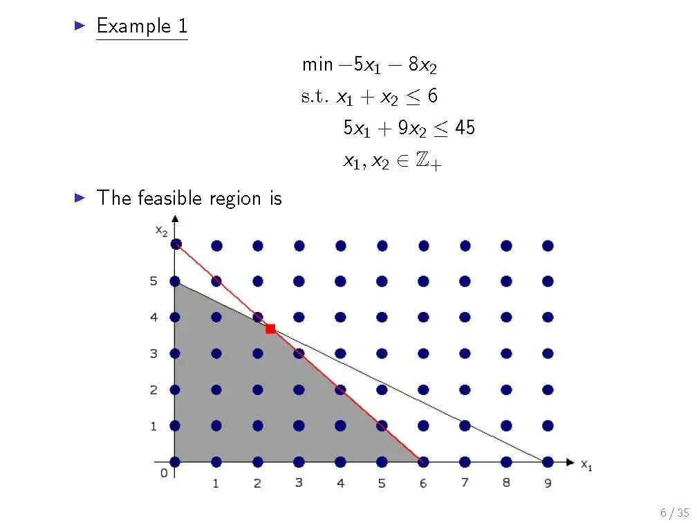
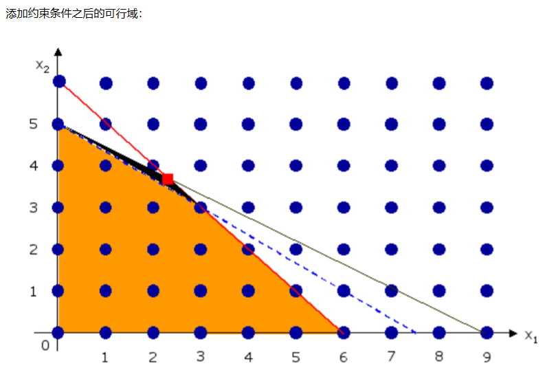
### 1.4说明
割平面法有很多种割的方式，Gomory的方法只是其中一种，他构造的这种方式可以在满足所有整数解的条件下排除掉当前的非整数最优解，由于是线性的约束，所以还会顺便排除掉一些其他的非整数解。但是约到后面割平面效果越差，因此需要搭配其他算法使用。
实际上，Gomory提出的割平面法只适用于纯整数规划，后续将学习适用于混合整数线性规划的切平面法
# 2023.12.7
## 1.混合整数割平面法
### 1.1步骤
有如图混合整数线性规划问题：
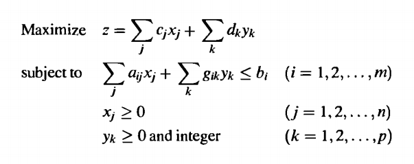
1.1.1 标准化
1.1.2 非零的$\bar{a}_{rj}$可分为的正数系数$\bar{a}_{rj}>0$和所有的负系数$\bar{a}_{rj}<0$。$\bar{g}_{rk}$为非基变量的系数。令$f_{rk}=\bar{g}_{rk}-\lfloor \bar{g}_{rk}\rfloor$，$f_{r0}=\bar{b}_{r}-\lfloor \bar{b}_{r}\rfloor$，即有
$\sum_{j:\bar{a}_{rj}>0}\bar{a}_{rj}x_j+\sum_{j:\bar{a}_{rj}<0}(\frac{f_{r0}}{f_{r0}-1})\bar{a}_{rj}x_j+\sum_{k:f_{rk}\leq f_{r0}}f_{rk}y_k+\sum_{k:f_{rk}> f_{r0}}\frac{f_{r0}(1-f_{rk})}{1-f_{r0}}y_k\geq f_{r0}$
其中，$x_j$为连续变量，$y_k$为整数变量
1.1.3 将构造的有效不等式添加到当前最优单纯形表中构成新问题继续迭代
1.1.4 发现无解或者符合条件的整数解就停止
### 1.2例题
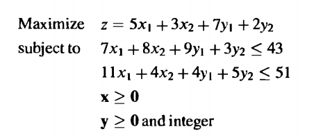
在松弛之后得到了最优单纯形表，提出了里面的小数部分最大的非基变量$y_1$行，即
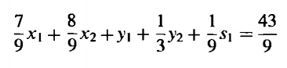
即有
$f_{r0}=\frac{7}{9},f_{r1}=0,f_{r2}=1/3\\
(\frac{7}{9}x_1+\frac{8}{9}x_2+\frac{1}{9}s_1)+(None)+(0y_1+\frac{1}{3}y_2)+(None)\geq \frac{7}{9}$
其中None表示这一项没有内容
# 2023.12.8
## 拉格朗日乘子法

## 拉格朗日对偶性与对偶问题的推导
原问题P
$$
\begin{aligned}
    &min\space c^Tx\\
    s.t.\space&\\
    &Ax\leq b\\
    &Cx=d\\
    %&x\geq 0\\
\end{aligned}
$$
构造拉格朗日函数为
$L(x,\lambda,\gamma)=c^Tx+\lambda^T(Ax-b)+\gamma^T(Cx-d)$
其中，$\lambda \geq 0,\gamma$ 无约束
**易得$\space max_{\lambda,\gamma,\lambda\geq 0}\space L(x,\lambda,\gamma)=c^Tx$**
证明：若$x\in S,S为Ax\leq b,Cx=d$的可行域
则$Ax-b\leq 0,Cx-d=0$
又$\lambda \geq 0$,故$\lambda^T(Ax-b)\leq 0$
故$max\space L$时，$\lambda^T(Ax-b)=0$，故$L=c^Tx$
**若$x\notin S$,则$L=-\infin$**
证明：$Ax-b> 0$,则$\lambda=\infin,Cx-d\neq 0$,则$\gamma$为$\infin$，符号与$Cx-d$相同
故$L=c^Tx+\infin+\infin=+\infin$
令$\theta_P(x)=\max_{\lambda,\gamma,\lambda\geq 0}L(x,\lambda,\gamma)$
这个$\theta_P(x)$是对$\lambda,\gamma$求最大化，因此得到的结果是一个关于$x$的函数
$\min_{x}\theta_P(x)=\min_{x}\max_{\lambda,\gamma,\lambda \geq 0}L(x,\lambda,\gamma)=\min_{x}\{max_{\lambda,\gamma,\lambda\geq 0}L(x,\lambda,\gamma),+\infin\}=\min_{x}\max_{\lambda,\gamma,\lambda \geq 0}L(x,\lambda,\gamma)$
令$\theta_D(\lambda,\gamma)=\min_{x}L(x,\lambda,\gamma)$
这个$\theta_D(\lambda,\gamma)$是对$x$求最小化，因此得到的结果是一个关于$\lambda$和$\gamma$的函数
$\max_{\lambda,\gamma,\lambda\geq 0}\theta_D(\lambda,\gamma)=\max_{\lambda,\gamma,\lambda\geq 0}\min_{x}L(x,\lambda,\gamma)$
由于值域里的最大值一定大于等于值域里的最小值，易知：
**$\min_{x}L(x,\lambda,\gamma)\leq L(x,\lambda,\gamma)\leq \max_{\lambda,\gamma,\lambda\geq 0}L(x,\lambda,\gamma)$**
令$P(x)=\min_{x}L(x,\lambda,\gamma),Q(\lambda,\gamma)=\max_{\lambda,\gamma,\lambda\geq 0}L(x,\lambda,\gamma)$
可得$\max_{\lambda,\gamma,\lambda\geq 0}P(x)\leq \min_{x}Q(\lambda,\gamma)$（P的值域整体小于等于Q的值域）
即有$\max_{\lambda,\gamma,\lambda\geq 0}\min_{x}L(x,\lambda,\gamma)\leq \min_{x}\max_{\lambda,\gamma,\lambda\geq 0}L(x,\lambda,\gamma)$
**$d^*=\max_{\lambda,\gamma,\lambda\geq 0}\min_{x}L(x,\lambda,\gamma)\leq \min_{x}\max_{\lambda,\gamma,\lambda\geq 0}L(x,\lambda,\gamma)=p^*$**
而$\max_{\lambda,\gamma,\lambda\geq 0}\min_{x}L(x,\lambda,\gamma)=\max_{\lambda,\gamma,\lambda\geq 0}\min_{x}\space c^Tx+\lambda^T(Ax-b)+\gamma^T(Cx-d)=\max_{\lambda,\gamma,\lambda\geq 0}\min_{x}\space -\lambda^Tb-\gamma^Td+(c^T+\lambda^TA+\gamma^TC)x$
根据$x$对$L(x,\lambda,\gamma)$取下界：（此处的x是无界的，x的界已经写在了拉格朗日函数里）
$$\min_{x}L(x,\lambda,\gamma)
=-\lambda^Tb-\gamma^Td+(c+A^T\lambda+C^T\gamma)^Tx\\
=\left\{
\begin{aligned}
&-\lambda^Tb-\gamma^Td\space\space& c+A^T\lambda+C^T\gamma=0 \\
&-\infin \space\space& otherwise \\
\end{aligned}
\right.
$$
显而易见，对偶问题$D$的值当$c^T+\lambda^TA+\gamma^TC=0$时才有意义，故对偶问题可写为
$\max_{\lambda,\gamma,\lambda\geq 0}-\lambda^Tb-\gamma^Td\\
s.t.\\
c+A^T\lambda+C^T\gamma=0\\
\lambda\geq 0$
