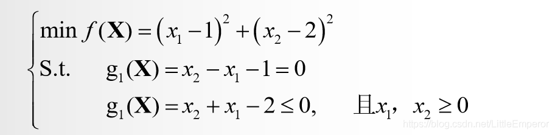
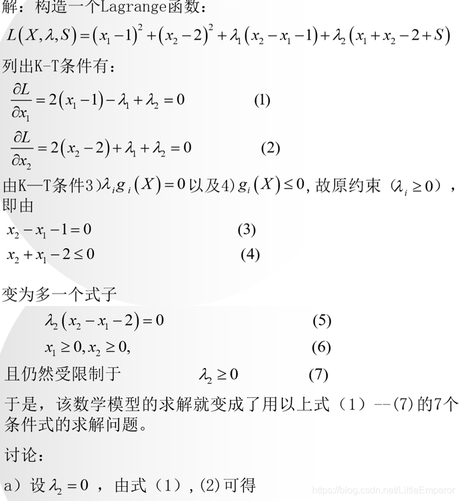
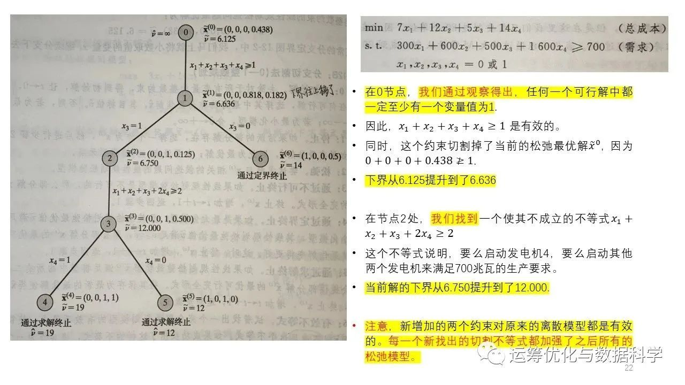
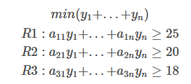
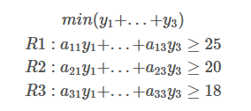
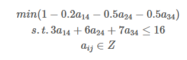
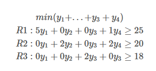
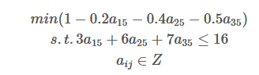
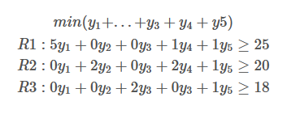
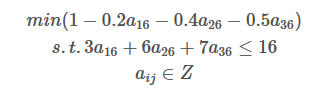

# 2023.11.14
1.顶点一定在边上，所以即便有无穷多最优解（可行边），那也一定存在顶点是最优解，因此最优解不一定是基可行解（基解、基最优解），
因为它不一定是基得来，可能在边上。如果最优解是有限的，那就不存在最优边，就一一对应了。

2.一般线性规划的标准型要求右端项大于等于0，且自变量范围大于0，还有变量数目大于等于约束数目

3.基变量是线性无关的几个变量，非基变量是除了基变量的变量，例如
$$
\begin{aligned}
&max\ \ z=2x_1+1x_2+3x_3\\
&x_1-x_3+x_4=5\\
&2x_1+x_2+x_3+x_5=6\\
&x_2+2x_3+x_6=7\\
\end{aligned}
$$
其中，系数矩阵为
$$
\begin{bmatrix}
1&0&-1&1&0&0\\
2&1&1&0&1&0\\
0&1&2&0&0&1\\
\end{bmatrix}
$$
基变量可以为除了$(x_2,x_5,x_6)$之外的所有组合。除了基变量之外的非基变量，在计算初始解时均为0，如令$(x_4,x_5,x_6)$为基变量,
则$(x_1,x_2,x_3)$为非基变量，即$(x_1,x_2,x_3)$为0，继而解方程计算$(x_4,x_5,x_6)$的取值。
基变量之间是线性无关的

4.每一次迭代，都是从一个顶点过渡到其相邻的顶点，其原理是，在迭代中，只有一个变量进基，1个变量出基，所以其余变量的取值是不变的，只有这两个变量的取值会发生变化，这里cue一下相邻的定义：说两个顶点是相邻的，是因为它们之间可以通过一次基变换直接转换，在几何上就是它们可以通过一条边直接连接

5.一般要求m\*n(m变量,n约束)的问题，m要大于等于n，其m\*n阶的系数矩阵的秩是n，其中任意一个n\*n的满秩子矩阵A都是系数矩阵的一个基，也称B为非奇异子矩阵，即B的行列式不为0（这里与基变量线性无关对应）

6.如果约束都是等号，且约束个数大于变量个数，根据克拉默法则，就一定有唯一解，且存在(n-m)个冗余约束。如果不全是等号，那就可以构造人工变量了。

7.还有一种情况，虽然变量个数大于约束个数，但是约束都是等号，不能加入松弛变量，那就需要使用两阶段法。第一阶段往每条约束里强行插入一个新变量，构成初始基，之后最小化插入的变量，使其取其下界0，这样的话就相当于没有插入，最后得到其余原先变量的初始解，再代入原来的数学模型里二阶段求解。

8.松弛变量是为了将小于等于不等式约束转换成等式约束而添加的变量；剩余变量是为了将大于等于不等式转为等式而添加的变量；人工变量是为了构成初始基，强行在等式里加入的变量

9.大M法是在大于等于约束的时候，减去一个剩余变量，还不能构成单位矩阵，所以还需要加上人工变量。加上人工变量后人工变量构成单位矩阵，之后将人工变量乘以大M体现在目标函数中

10.构造的人工变量、松弛变量作为初始基时，方程组是一定有解的，因为其他非基变量均为0，此时的基变量直接就等于右端项，故而有解（右端项非负，如果是负就处理成非负），因此初始基可以进行迭代，所以大M法可以直接以M为惩罚项就去迭代。

11.如果是≥的形式，转换成标准型的时候，需要减去一个剩余变量，这时候变成等式。但是这个剩余变量的系数是-1，还不能构成单位矩阵，因此要么乘以-1，要么添加人工变量。如果乘以-1，此时右端项b原先是正，现在变成了负，那就不是标准型了（如果原先b是负，乘以-1就变成正了，就不用下面工作，可以直接进行迭代）。因为不能构成标准型了，所以还需要添加一个人工变量，这个人工变量因为是强行添加进去的，所以取值需要是0，继而使用大M法或者两阶段法。

12.两阶段法中，最后的非基变量一定不会是人工变量，因为人工变量需要是非基变量才能取值为0，在此情况下，一定有m（m为约束个数）个基变量，这m个基变量为原始决策变量或者是剩余变量，而不可能是人工变量。因此第一阶段求完初始解后，就可以在此基变量（单位矩阵）的基础上，进行第二轮迭代。

13.也有一种可能，原右端项为0，因此第一阶段人工变量可以为基变量，直接取值为0，但是这种情况不会发生，因为第一阶段人工变量的ci为1（min），那么它就会被换出，尽管换入的变量的θ都为0，也不影响人工变量会被换出

14.两阶段法就是把大M惩罚项拆解开了，先在第一阶段求得人工变量为0下的决策变量的取值，这个值在z为0时一定是可行解（z不为0代表人工变量不为0，即原约束等号不成立，即原问题无解）
# 2023.11.30
## 1.分支定界法
    1.在求解整数规划时，先求其松弛问题（放弃整数约束）的最优解
    2.在这个最优解的基础上，进行分枝剪枝，如果存在$x=2.4$，那就将问题分为$x\leq 2$与$x\geq 2$这两个子问题，求解这两个问题，并记录每个问题的最优解
    3.如果出现符合原题的整数解，则标记此整数解为下界（松弛问题为上界）
    4.如果当前存在下界，且一个分支的目标函数值差于当前下界，就放弃这个分支
    5.如果当前存在下界，且分支的目标函数值不差于当前下界，那就继续分支
    6.如果当前不存在下界，且两个分支都没求出符合题意的整数解，就都保留，继续分支
    7.如果一个分支全为整数解，且其他分支要么不可行，要么被剪枝，那么当前分支即为整数解

**总结就是，松弛问题都比不上当前分支的全整数可行解，那这个松弛问题分支就得被剪掉，没有继续研究的必要了**
# 2023.12.4
## 单纯形法
1.对于标准型（最大化）问题，取最优需要所有非基变量检验数都小于等于0，并且所有基变量检验数都等于0，检验数的开始值为目标函数的C，之后每次迭代随行变换变化。
2.在每次迭代的时候，选入基变量，选择标准是检验数最小的（负值），其实际含义为减少1个其会使目标函数上升检验数这么大，即上升最快。
3.出基变量为当前右端项除以aik（xk为入基变量）的最小值（非负）。因为θ的值实际上代表了入基变量增加的最大量，而不会破坏其他基变量（约束）的非负性。如果我们选择θ大的基变量作为出基变量，那么可能会导致其他基变量变为负数，从而破坏解的可行性。
4.选定进出基变量之后，更新单纯形表，令入基变量列为单位矩阵的列，即该行除以aik，aik变为了1，其余行减去ajk*aij/aik，检验数也是如此更新。
5.选取的xk的时候，一定要有aik是正的，因为如果所有的aik都是负的，且右端项是正的，那么xk的取值就都是无界的，目标函数也就无界了
6.每次单纯形表更新，就对应一个新的问题，因此各个数据都会相应地发生变化
**7.检验数的实际意义
检验数的计算公式是$\sigma_j=c_j-\sum_{i\in x_B}^{n}c_ia_{ij},\forall j\in x_N$，其意义是，增加1个单位的$x_j$，会使每个约束里的其余基变量减少$a_{ij}$个单位，因此会使目标函数减少$c_ia_{ij}$，之后加和。如果增加1个单位的$x_j$增加的收益比这所有减少的收益还要多，那就说明可以增加$x_j$**
**8.影子价格的意义
原问题中某个右端项增加1个单位给目标函数带来的收益。$\delta z=c_r$**
## 检验数的实际意义
1.检验数的计算公式是$\sigma_j=c_j-\sum_{i\in x_B}^{n}c_ia_{ij},\forall j\in x_N$，其意义是，增加1个单位的$x_j$，会使每个约束里的其余基变量减少$a_{ij}$个单位，因此会使目标函数减少$c_ia_{ij}$，之后加和。如果增加1个单位的$x_j$增加的收益比这所有减少的收益还要多，那就说明可以增加$x_j$
2.如果某个变量的检验数大于0，但是其列向量均小于0，就代表可以无限制地增加这个变量，那么目标函数也会无限制地增加，问题无界解
3.最优解的基变量的检验数均需要为0，如果存在非基变量的检验数为0，说明存在无穷多最优解，这个非基变量无论取何值都不会影响其他变量的取值，也不会影响最优解的值
4.如果存在最优解，则最优解中的基变量的检验数均为0
## 退化
在线性规划的单纯形法中，当我们在确定换入基变量时，计算出的θ出现两个或两个以上相等的最小值时，称这种情况为退化。
1.具体来说，退化解主要有以下两种情况：
**基本可行解中的基变量等于零**：在单纯形表中，基变量$x_B=B^{-1}b-B^ {-1}Nx_N$。如果基可行解中出现一个或多个基变量等于零,$b=0$,即$B^{-1}b=0$，为了保证基变量非负（即$x_B \geq 0$），需要使$B^ {-1}Nx_N$为0，即无法改变目标函数值$f(x)=c_BB^{-1}b+(c_N-c_BB^{-1}N)x_N$。
**最小比值原则确定换出基的变量时，存在两个以上相同最小比值**：在确定换出基的变量时，如果存在两个以上相同最小比值，也称这种情况为退化。这种情况下，可能会在这两个变量之间连续迭代，也可能算法迭代一段时间后，这两个变量又产生进基和出基，无法改变目标函数值。
2.退化解的出现通常是由于模型中存在多余的约束。几何上，退化解就是两个或多个极点重合。
3.如果在最终表中原问题的解为非退化最优解，而其对偶问题的最优解为退化解，则原问题一定有无穷多个最优解
4.退化可能与无穷多最优解同时出现，但并不互相是充分条件或者必要条件。
## 对偶理论
1.max问题的变量符号与min问题的约束符号是相同的，其余都是相反的
2.强对偶定理：原问题有最优解且对偶问题也有最优解，则原问题的最优解的值等于对偶问题的最优解的值
3.弱对偶定理：原问题有可行解且对偶问题也有可行解，则原问题的可行解的值小于等于对偶问题的可行解的值
4.互补松弛定理：如果对偶问题某一变量非0，则该变量对应的原问题约束严格等于0
5.原问题的无界解，对偶问题无可行解
6.原问题的无可行解，对偶问题无界解或者是无可行解
7.影子价格的意义
影子价格就是资源的边际价值，即某个右端资源项增加一个单位，重新计算后会使目标函数增加的值，这个值等于其对偶问题中，该约束对应的变量在最优解的取值。
这是因为在对偶问题中，目标函数为$min\space z=\sum_{i\in D}{b_iy_i}$，原问题的资源$b_i$在对偶问题里是目标函数的系数，因此增加一个单位的$b_i$会对对偶问题的目标函数增加$(b_i+1)y_i-b_iy_i=y_i$，由于强对偶定理可得，原问题目标函数也增加$y_i$，因此$y_i$就是$i$资源的影子价格。
8.如果影子价格为0，代表该资源冗余。
9.在计算检验数时，公式为$\sigma_j=c_j-C_BB^{-1}a_j$，其中$C_BB^{-1}$为影子价格（或者说是对偶变量的值），因此这个还可以理解为增加1单位的$j$会减少多少其他的$a_{rj}$倍影子价格的和。
## 对偶单纯形法
### 要点
    1.原问题如果约束少，但是变量很多，这时候可以使用对偶单纯形法。这是因为原问题转化为对偶问题后，原来的约束变成了新问题的变量，
    原来的变量变成了新问题的约束，由于变量的数量减少，每次迭代需要处理的数据量也相应减少，从而可以减少计算量。
    2.对偶单纯形法不要求对偶问题的初始解是可行解，因为初始的松弛变量等于右端项，可以为负
    3.在使用对偶单纯形法时，要求右端项中必须有负分量，而大多数线性规划问题的初始单纯形表很难满足要求，因此，对偶单纯形法一般不会单独使用。
    而使用单纯形法时，标准形式的约束要求右端项b必须不能有负分量，因为在标准形式里，资源不能是负的
    4.由于对偶单纯形法允许右端项为负数，因此就没有剩余变量这个概念了，可以化为>=后减去剩余变量
    5.对偶单纯形法使用时，如果已经转换成max，则需要目标函数均为负
### 流程
1.根据松弛变量当做初始基开始迭代，要求此时所有目标函数的价值系数都为非负，b里有负分量，如果b里没有负分量，则当前解就是最优解
2.确定出基变量（单纯形法先确定的是入基变量），出基变量为bi最小的行对应的基变量
3.可行性检验，如果对于出基变量这一行r，所有的ari都为正，即没有系数为负，那就无解
4.如果不满足3，就确定入基变量，入基变量为ck/ark最小的列对应的变量（要求ck和ark均为负），ck就是当前单纯形表的目标函数系数
5.更新单纯形表
6.与单纯形法相同，若所有变量检验数均非正（这也要求对偶单纯形法的目标函数是max），则最优
## 修正单纯形法
### 1.概述
修正单纯形法的一个关键思想就是保留基变量的逆矩阵，这样在需要入基变量时，可以直接使用这个逆矩阵来计算新的基变量的系数。这是因为基变量的逆矩阵实际上已经包含了转轴变换的信息，所以我们可以直接使用它来计算新的基变量的系数，而不需要对非基变量的系数矩阵进行任何改变。这种方法大大提高了计算效率，因为我们不需要在每次迭代时都重新计算整个系数矩阵。
### 2.具体步骤
2.1标准化
2.2获取基变量
2.3非基变量的下降向量$\bar{c}^T_N=c^T_BB^{-1}N-c^T_N$,其中第$j$个非基变量的可使目标函数下降值$\bar{c}_j=c^T_BB^{-1}a_j-c_j$
2.4在每次迭代时，对偶解$u^T=c^T_BB^{-1}$
2.5选取的入基变量的系数列向量为（因为修正单纯形法只会保留基变量的系数矩阵，非基变量的系数矩阵是在每次迭代时根据原始系数列向量与当前基变量的系数矩阵的逆矩阵的乘积运算得来的）$\bar{a}_j=B^{-1}a_j$，同理，所有得基变量的系数矩阵为$\bar{A}_N=B^{-1}N$，由于每次迭代我们只需要一个入基的非基变量，所以不需要全部计算系数矩阵，只需要知道怎么计算系数矩阵即可。
2.6当前迭代的目标函数值为$z=c^T_BB^{-1}b=c^T_B\bar{b}$
2.7选择$\bar{c}_j$最小的（$-\bar c_j=\sigma_j$，因此$\bar c_j$越小，实际对目标函数的提升就越大）当做入基变量，因为它实际使目标函数增加最快，拿去它使目标函数增长最快
2.8选择出基变量，选择标准还是$r=\{i:min_i(\frac{\bar{b}_i}{\bar{a}_{ij}},\bar{a}_{ij}>0)\}$
2.9更新系数矩阵，返回2.3
2.10如果在某次迭代时，发现$\bar{c}^T_N$均为正，也就是说没有非基变量可以使目标函数增加了，即求得最优解，迭代结束
### 3.例题

#### 0.初始化

#### 1.迭代1
$$
\bar{c}^T_N=c^T_BB^{-1}N-C^T_N\\
\bar{c}^T_N=u^TN-c^T_N\\
\bar{c}^T_N=(0,0,0)\begin{bmatrix}
1&2&3&1&-3\\
2&-1&2&2&1\\
-3&2&1&-1&2\\
\end{bmatrix}-(4,3,1,7,6)\\
\bar{c}^T_N=(-4,-3,-1,-7,-6)\\
$$
选择$x_4$当做入基变量，因为他等于-7
$$
a_4=B^{-1}a_4\\
a_4=\begin{bmatrix}
    1&0&0\\
    0&1&0\\
    0&0&1
\end{bmatrix}
\begin{bmatrix}
    1\\
    2\\
    -1
\end{bmatrix}\\
a_4=\begin{bmatrix}
    1\\
    2\\
    -1
\end{bmatrix}
$$
即

$min \{\frac{9}{1},\frac{10}{2}\}=5$，故换出$s_2$
将$\bar{a}_4$转换成单位向量，即

迭代1结束
#### 2.迭代2
$u^T=(0,3.5,0)$，也就是当前单纯形表问题的目标函数
$$
\bar{c}^T_N=c^T_BB^{-1}N-C^T_N\\
\bar{c}^T_N=u^TN-c^T_N\\
\bar{c}^T_N=(0,3.5,0)\begin{bmatrix}
1&2&3&1&-3&1&0&0\\
2&-1&2&2&1&0&1&0\\
-3&2&1&-1&2&0&0&1\\
\end{bmatrix}-(4,3,1,7,6,0,0,0)\\
\bar{c}^T_N=(7,-3.5,7,7,3.5,0,3.5,0)-(4,3,1,7,6,0,0,0)\\
\bar{c}^T_N=(3,-6.5,6,0,-2.5,0,3.5,0)\\
$$

因此$x_2$入基

因此$s_1$出基
即

#### 3.循环迭代
一直到$\bar{c}^T_N$没有负项
#### 4.规律总结
可以看出，单纯形表里的z行，也就是目标函数行或者说是$u^T$一直代表的是松弛变量$s_1,s_2,s_3$，其他来个变量，它的那一列也只是加在单纯形表后面，用使新加列变为单位向量的行变化改变松弛变量的系数矩阵与$u^T$，$u^T$也可以认为是检验数，当前目标函数系数

# 2023.12.6
## 1.分数割平面法
### 1.1步骤
1.1.1化为标准型
1.1.2将约束全部转换成整数（系数是分数就通分）
1.1.3单纯形法迭代获得最优解
1.1.4选择当前单纯形表中，基变量小数部分最大的那个变量的那一行，把那一行化为
**（整数系数x变量-整数资源系数）+小数系数x变量=小数资源系数**
的形式，其中分数化为整数和小数时，整数部分为向下取整，小数部分为该数减去整数部分
1.1.5由于小数部分是一个数减去其向下取整得来的，因此小数部分的系数一定是大于等于0 ，且变量也大于等于0，因此整个小数部分大于等于0
因此有
**小数资源系数-小数部分<=小数资源部分<=1**
要想减去这部分小数，就需要令
**小数资源系数-小数部分<=0**
即
**小数部分<=小数资源系数**
1.1.6针对1.1.5最后生成的新的约束，添加到当前的单纯形表中，继续迭代
1.1.7重复割平面操作，直到满足所有整数解要求或者不可行
### 1.2例题

其中，松弛问题的最优单纯形表为

1.2.1 $y_1$可以分为5+4/7，比$y_2,y_3$的小数部分都大，所以选择$y_1$这一行，故有
$y_1+0y_2+0y_3+\frac{3}{7}y_4+\frac{2}{7}y_5=\frac{39}{7}$
拆解为
$(y_1-5)+\frac{3}{7}y_4+\frac{2}{7}y_5=\frac{4}{7}$
故可以添加约束:
$-\frac{3}{7}y_4+-\frac{2}{7}y_5\leq -\frac{4}{7}$
因为小数部分是某数减去其向下取整，因此小数部分一定是正的。我国该数是负数，比如$-\frac{11}{3}$，那就分解成$-4+
\frac{1}{3}$
1.2.2新的单纯形表为

1.2.3迭代最优为：

1.2.4重复1.2.1-1.2.3直到满足所有整数约束，即为最优解。因为再继续添加约束，解的质量一定不会高于当前解，当前解相当于之后解的松弛解，故直接输出最优解。或者发现不可行
### 1.3证明
$$
x_r+\sum_{i\in N}{}a_{ri}x_i=b_r,r\in B\space(1)\\
x_B为基变量，x_N为非基变量\\
因为X\geq 0,得\\
x_r+\sum_{i\in N}{}\lfloor a_{ri}\rfloor x_i\leq b_r\space(2)\\
因为X为整数解，上式左侧必为整数，因此有\\
x_r+\sum_{i\in N}{}\lfloor a_{ri}\rfloor x_i\leq \lfloor b_r\rfloor \space(3)\\
由此可得(1)-(3)\\
\sum_{i\in N}{}(a_{ri}-\lfloor a_{ri}\rfloor)x_i\geq b_r-\lfloor b_r\rfloor \space(4)\\
令f_{ri}=a_{ri}-\lfloor a_{ri}\rfloor,f_r=b_r-\lfloor b_r\rfloor \space(5)\\
有\\
\sum_{i\in N}{}f_{ri}x_i\geq f_r \space(6)\\
对于非整数解\\
b_r-\lfloor b_r\rfloor =f_r>0 \space(7)\\
对于当前最优解x^*，其中x_i=0,i\in N,因此\\
\sum_{i\in N}{}f_{ri}x_i=0 \space(8)\\
$$
(8)与(7)的f_r冲突，因此当前最优解不满足此约束。又因为此约束对所有X为整数都满足（向下取整为0即可），故这条有效不等式(6)就减去了部分非整数解，保留了整数解

### 1.4说明
割平面法有很多种割的方式，Gomory的方法只是其中一种，他构造的这种方式可以在满足所有整数解的条件下排除掉当前的非整数最优解，由于是线性的约束，所以还会顺便排除掉一些其他的非整数解。但是越到后面割平面效果越差，因此需要搭配其他算法使用。
实际上，Gomory提出的割平面法只适用于纯整数规划，后续将学习适用于混合整数线性规划的切平面法
# 2023.12.7
## 1.混合整数割平面法
### 1.1步骤
有如图混合整数线性规划问题：

1.1.1 标准化
1.1.2 非零的$\bar{a}_{rj}$可分为的正数系数$\bar{a}_{rj}>0$和所有的负系数$\bar{a}_{rj}<0$。$\bar{g}_{rk}$为非基变量的系数。令$f_{rk}=\bar{g}_{rk}-\lfloor \bar{g}_{rk}\rfloor$，$f_{r0}=\bar{b}_{r}-\lfloor \bar{b}_{r}\rfloor$，即有
$\sum_{j:\bar{a}_{rj}>0}\bar{a}_{rj}x_j+\sum_{j:\bar{a}_{rj}<0}(\frac{f_{r0}}{f_{r0}-1})\bar{a}_{rj}x_j+\sum_{k:f_{rk}\leq f_{r0}}f_{rk}y_k+\sum_{k:f_{rk}> f_{r0}}\frac{f_{r0}(1-f_{rk})}{1-f_{r0}}y_k\geq f_{r0}$
其中，$x_j$为连续变量，$y_k$为整数变量
1.1.3 将构造的有效不等式添加到当前最优单纯形表中构成新问题继续迭代
1.1.4 发现无解或者符合条件的整数解就停止
### 1.2例题

在松弛之后得到了最优单纯形表，提出了里面的小数部分最大的非基变量$y_1$行，即

即有
$f_{r0}=\frac{7}{9},f_{r1}=0,f_{r2}=1/3\\
(\frac{7}{9}x_1+\frac{8}{9}x_2+\frac{1}{9}s_1)+(None)+(0y_1+\frac{1}{3}y_2)+(None)\geq \frac{7}{9}$
其中None表示这一项没有内容
# 2023.12.8
## 1.拉格朗日对偶性与对偶问题的推导
原问题P
$$
\begin{aligned}
    &min\space c^Tx\\
    s.t.\space&\\
    &Ax\leq b\\
    &Cx=d\\
    %&x\geq 0\\
\end{aligned}
$$
构造拉格朗日函数为
$L(x,\lambda,\gamma)=c^Tx+\lambda^T(Ax-b)+\gamma^T(Cx-d)$
其中，$\lambda \geq 0,\gamma$ 无约束
**易得$\space min_{x}max_{\lambda,\gamma,\lambda\geq 0}\space L(x,\lambda,\gamma)=\min_{x}c^Tx$**
证明：
若$x\in S,S为Ax\leq b,Cx=d$的可行域
则$Ax-b\leq 0,Cx-d=0$
又$\lambda \geq 0$,故$\lambda^T(Ax-b)\leq 0$
故$max\space L$时，$\lambda^T(Ax-b)=0$，故$L=c^Tx$
若$x\notin S$,则$L=+\infin$
证明：$Ax-b> 0$,则$\lambda=+\infin,Cx-d\neq 0$,则$\gamma$为$\infin$，符号与$Cx-d$相同
故$L=c^Tx+\infin+\infin=+\infin$
**即有$\min_{x}\{c^Tx,+\infin\}=\min_{x}c^Tx$**
令$\theta_P(x)=\max_{\lambda,\gamma,\lambda\geq 0}L(x,\lambda,\gamma)$
这个$\theta_P(x)$是对$\lambda,\gamma$求最大化，因此得到的结果是一个关于$x$的函数
$\min_{x}\theta_P(x)=\min_{x}\max_{\lambda,\gamma,\lambda \geq 0}L(x,\lambda,\gamma)=\min_{x}\{max_{\lambda,\gamma,\lambda\geq 0}L(x,\lambda,\gamma),+\infin\}=\min_{x}\max_{\lambda,\gamma,\lambda \geq 0}L(x,\lambda,\gamma)$
令$\theta_D(\lambda,\gamma)=\min_{x}L(x,\lambda,\gamma)$
这个$\theta_D(\lambda,\gamma)$是对$x$求最小化，因此得到的结果是一个关于$\lambda$和$\gamma$的函数
$\max_{\lambda,\gamma,\lambda\geq 0}\theta_D(\lambda,\gamma)=\max_{\lambda,\gamma,\lambda\geq 0}\min_{x}L(x,\lambda,\gamma)$
由于值域里的最大值一定大于等于值域里的最小值，易知：
**$\min_{x}L(x,\lambda,\gamma)\leq L(x,\lambda,\gamma)\leq \max_{\lambda,\gamma,\lambda\geq 0}L(x,\lambda,\gamma)$**
令$P(x)=\min_{x}L(x,\lambda,\gamma),Q(\lambda,\gamma)=\max_{\lambda,\gamma,\lambda\geq 0}L(x,\lambda,\gamma)$
可得$\max_{\lambda,\gamma,\lambda\geq 0}P(x)\leq \min_{x}Q(\lambda,\gamma)$（P的值域整体小于等于Q的值域）
即有$\max_{\lambda,\gamma,\lambda\geq 0}\min_{x}L(x,\lambda,\gamma)\leq \min_{x}\max_{\lambda,\gamma,\lambda\geq 0}L(x,\lambda,\gamma)$
**$d^*=\max_{\lambda,\gamma,\lambda\geq 0}\min_{x}L(x,\lambda,\gamma)\leq \min_{x}\max_{\lambda,\gamma,\lambda\geq 0}L(x,\lambda,\gamma)=p^*$**
而$\max_{\lambda,\gamma,\lambda\geq 0}\min_{x}L(x,\lambda,\gamma)=\max_{\lambda,\gamma,\lambda\geq 0}\min_{x}\space c^Tx+\lambda^T(Ax-b)+\gamma^T(Cx-d)=\max_{\lambda,\gamma,\lambda\geq 0}\min_{x}\space -\lambda^Tb-\gamma^Td+(c^T+\lambda^TA+\gamma^TC)x$
即有：（此处的x是无界的，x的界已经写在了拉格朗日函数里）
$$\min_{x}L(x,\lambda,\gamma)
=-\lambda^Tb-\gamma^Td+(c+A^T\lambda+C^T\gamma)^Tx\\
=\left\{
\begin{aligned}
&-\lambda^Tb-\gamma^Td\space\space& c+A^T\lambda+C^T\gamma=0 \\
&-\infin \space\space& otherwise \\
\end{aligned}
\right.
$$
对偶问题即为：
$\max_{\lambda,\gamma,\lambda\geq 0}\min_{x}L(x,\lambda,\gamma)=\max_{\lambda,\gamma,\lambda\geq 0}\{-\lambda^Tb-\gamma^Td,-\infin\}=\max_{\lambda,\gamma,\lambda\geq 0}-\lambda^Tb-\gamma^Td$
故对偶问题可写为
$\max_{\lambda,\gamma,\lambda\geq 0}-\lambda^Tb-\gamma^Td\\
s.t.\\
c+A^T\lambda+C^T\gamma=0\\
\lambda\geq 0$
# 2023.12.11
## 1. KKT条件及其证明
给定一般的凸优化问题（不是凸优化的话KKT只是必要性而不是充分性）
$\min_{x}\space f(x)\space s.t \space h_i(x)\leq 0,l_j(x)=0,i\in I,j\in J$
构建拉格朗日函数为：$L(x,u,v)=f(x)+\sum_{i\in I}u_ih_i(x)+\sum_{j\in J}v_jl_j(x)$
拉格朗日对偶函数为：$g(u,v)=\min_{x\in S}L(x,u,v)$
对偶问题就为:$max_{u,v}g(u,v)\space s.t\space u\geq 0$
KKT条件为：
$\nabla_xL(x^*,u^*,v^*)=\nabla f(x^*)+\sum_{i\in I}u^*_i\nabla h_i(x^*)+\sum_{j\in J}v^*_j\nabla l_j(x^*)=0----Stationarity$
$u_ih_i(x)=0,\forall i\in I-----Complementary\space Slackness$
$h_i(x)\leq 0,l_j(x)=0,\forall i\in I,j\in J------Primal Feasibility$
$u_i\geq 0,\forall i\in I------Daul Feasibility$
因此，对于具有强对偶性的优化问题，其存在至少一个可行解，那么下列问题等价：
$x^*$是原问题最优解,$u^*,v^*$是对偶问题最优解<==>$x^*,u^*,v^*$满足KKT条件
**证明：**
**（1）必要性**
如果$x^*$是原问题最优解,$u^*,v^*$是对偶问题最优解，且保持强对偶性，即对偶间隙为0，那么：
$f(x^*)=g(u^*,v^*)=\min_{x}L(x,u^*,v^*)=\min_{x}f(x)+\sum_{i\in I}u^*_ih_i(x)+\sum_{j\in J}v^*_jl_j(x)\leq f(x^*)+\sum_{i\in I}u^*_ih_i(x^*)+\sum_{j\in J}v^*_jl_j(x^*)\leq f(x^*)$，其中$S$为$x$的可行域
1.对于$\min_{x}f(x)+\sum_{i\in I}u^*_ih_i(x)+\sum_{j\in J}v^*_jl_j(x)\leq f(x^*)+\sum_{i\in I}u^*_ih_i(x^*)+\sum_{j\in J}v^*_jl_j(x^*)$
因为$x^*$是$\min_{x}f(x)+\sum_{i\in I}u^*_ih_i(x)+\sum_{j\in J}v^*_jl_j(x)$的最优解，因此满足不等式，且梯度为0，即Stationarity
2.$f(x^*)+\sum_{i\in I}u^*_ih_i(x^*)+\sum_{j\in J}v^*_jl_j(x^*)\leq f(x^*)$，因为$h_i(x)\leq 0,u^*_i\geq 0$，故$u^*_ih_i(x)\leq 0$，故不等式成立。夹逼所以等式成立，等号成立时代表$\sum_{i\in I}u^*_ih_i(x)=0$，即$u^*_ih_i(x)= 0$。即Complementary Slackness
3.原始可行性和对偶可行性是约束
4.综上，若$x^*$是原问题最优解,$u^*,v^*$是对偶问题最优解，且保持强对偶性，则$x^*,u^*,v^*$必须满足KKT条件
**（2）充分性**
若存在$x^*,u^*,v^*$满足KKT条件，则：
$g(u^*,v^*)=f(x^*)+\sum_{i\in I}u^*_ih_i(x^*)+\sum_{j\in J}v^*_jl_j(x^*)=f(x^*)$
1.$g(u^*,v^*)=f(x^*)+\sum_{i\in I}u^*_ih_i(x^*)+\sum_{j\in J}v^*_jl_j(x^*)$是根据Stationarity得来，因为凸函数梯度为0的点就是全局极小值点，根据强对偶性可以得出等号。这里也是为什么要限定优化函数为凸函数，如果优化函数是非凸的，那么梯度为0的点就可能是局部极小值点，这种情况下，KKT就只是必要条件而非充分条件了。
2.$f(x^*)+\sum_{i\in I}u^*_ih_i(x^*)+\sum_{j\in J}v^*_jl_j(x^*)=f(x^*)$是由Complementary Salckness得来
3.因此对偶间隙为0，并且$x^*$为原始可行解，$u^*,v^*$为对偶可行解，所以$x^*$为原始最优解，$u^*,v^*$为对偶最优行解
## 2.例题

# 2023.12.12
## Branch and cut
### 1.步骤
1.线性松弛，得到松弛问题，松弛问题无可行解则结束；松弛问题有最优解，判断是否满足所有约束，满足则结束，不满足就设置下界为负无穷，上界为当前最优解目标函数值，并且将当前问题添加到结点列表里
2.如果结点列表为空，说明所有分支探察完毕，没有可行解，则结束。否则就从里面选择一个结点，进入第3步
3.如果当前子问题（结点）是不可行的，则将其从结点列表里删除，返回步骤2，否则进入步骤4
4.生成当前子问题的cuts，如果添加不了新的cut了，就进入步骤5.否则添加一个cut，之后返回步骤3
5.如果当前存在有界下界（有当值可行解），判断当前子问题的目标函数值，如果当前子问题目标函数值小于下界，说明没有进一步探察的必要了，就从结点列表里删除当前节点，之后返回步骤2。否则，如果当前解满足全部原问题约束，就进入步骤6，没有满足，就进入步骤7
6.当前解满足全部原问题约束，就更新当值解，并返回步骤1
7.当前问题还有进一步约束的必要，在这一步就不是添加cutting plane了，而是branching，选择一个变量进行分支，之后把分支后行成的两个子问题放回到结点列表，再返回步骤2
### 2.分割方法
分割方法分为Rounding, Disjunction, Lifing三种，三种各有应用场景
#### 2.1纯整数规划的切割方法
1.Gomory Fractional Cut
2.Chvatal-Gomory Cut
3.Pure Integer Rounding Cut
4.Objective Integrality Cut
#### 2.2混合整数规划的切割方法
1.Gomory Mixed Integer Cut
2.Mixed Integer Rounding Cut
#### 2.3 0-1整数规划的切割方法
1.Knapsack Cover
2.Lifted Knapsack Cover
3.GUB Cover
### 2.例题

### 3.注解
1.分支操作是在第4步时，添加不了新的cut了，才进行分支的，否则就添加cut回3
# 2023.12.20
时隔多日，我也终于重拾了OR的学习，零零碎碎地学习了很久的列生成，也终于在今天敢于开始作关于列生成的笔记了
# 列生成
## 1 思想
1.1 列生成是一种求解大规模线性规划的问题（不能直接用于整数、混合整数规划，需要搭配分支定界），本质上是单纯型法。
1.2 列生成在求解线性规划时，尤其是适合求解集合覆盖问题，例如vrp，有n个点就可能有n!个集合，但是列生成算法不需要知道到底有多少集合 ，每个集合是什么，它可以通过求解子问题的方式动态添加集合，大大减少了计算复杂度   
1.3 列生成适合求解变量多于约束的问题，因为不同变量构成的组合太多了，计算太过复杂
## 2 步骤
2.1 构建原问题的集合覆盖模型
2.2 构建集合覆盖模型的松弛线性问题LMP
2.3 根究LMP生成RLMP，实际上就是限制集合范围，原先的集合可能是无穷无尽的，现在从集合里选出若干项，构成满足初始解的子集合$\omega_1$，这几个子集合要满足LMP的约束，这一步可以用启发式算法获得初始集合
2.4 构建子问题，子问题的约束需要满足每个集合内部的约束，比如vrp需要满足自己的载重、时间窗约束等等，子问题的目标函数是检验数，检验数就是当前新路径的成本减去添加新路径后会顶掉的老路径的成本和，比如vrp的成本就是当前集合构成的路径的最优解的总路径长度。**注意，求解子问题时，若果有整数要求，那就求解整数解，子问题不能是松弛解**。
2.5 根据子问题求得的解计算检验数，检验数的计算公式是$\sigma_{k}=c_k-\sum_{i}{}c_{i}a_{ik}$，这就相当于给当前最优解的问题新添一列，让其继续迭代，看能不能再找到更优解。
是否有更优解的标准就是添加的这一列的检验数是否小于0（对于最小化问题）。
其中$c_k$就是当前子问题的集合的成本，而减去的后半部分$\sum_{i}{}c_{i}a_{ik}$就相当于新建一列的系数乘以基变量的目标函数。
众所周知，当前问题最优解构成的新问题的目标函数是不确定的，会随着迭代的变化而变化，但是其是可以计算的，它的值就等于对偶问题的对应对偶变量的值（对偶问题的资源约束就是原问题的目标函数的系数，对偶问题最优解时，基变量系数为1，因此基变量取值就是其资源系数，也就是原问题的目标函数的系数，**最优解所构成的当前问题，即使换成对偶问题，也依然是最优的，无法进行迭代**
**因此就可以通过新构成列的系数乘以对应的对偶变量的值从而得到原问题的检验数**
2.6 若检验数小于0，说明添加当前列后，主问题会有进一步下降的空间（可以再次进行迭代），那么就把这一列添加到主问题里，继续求主问题的最优，然后再重复求解子问题、添加列。如果检验数大于等于0，说明没有进一步下降的空间了，那么就停止迭代，列生成终止。
## 3 例题
### 3.1 木材切割问题
有以下问题，原纸卷每个长为L=17m，顾客们分别需要25个3m长，20个5m长，18个7m长的纸卷。那么需要怎样切割才能使得浪费最小呢？
$P$是所有可行的裁剪方案的集合，里面方案的总数为n(我们并不需要确切的知道这个值是多少，只需要知道它很大)。
$a_{ij}$表示第j种方案里类别i的个数。
$y_j$表示第 j 种方案的选择个数。
于是有：

0.首先找到一个初始解
可以得到3种切割方案：3米的切5个、5米的切3个、7米的切2个
即有

其中

之后便可计算对偶变量，开始迭代
1.计算得对偶变量为$[0.2,0.5,0.5]$，这三个对偶变量就是原问题的三种有效的切割方案的各自的成本 **（对偶问题的资源变量也就是对偶变量的值就是原问题的目标函数的系数）**
可构成新的子问题，子问题：

计算可得
子问题目标函数为-0.2，最优解为$a_4=[1,2,0]$，目标函数即检验数小于0，代表新加的列（切割方案）会使原问题目标函数减小，因此可以添加
2.于是可得新的受限主问题为：

对偶变量等于$[0.2,0.4,0.5]$，于是新的子问题为：

求解子问题得目标函数为-0.1，因此可加入列，最优解为$a_5=[1,1,1]$
3.再次更新受限主问题：

得对偶变量为[0.2,0.4,0.4]，子问题为：

求得目标函数为0，无法给原问题带来增益，迭代结束
4.因此原问题就为

求解即为线性松弛的主问题最优解
**5.为什么主问题的对偶变量乘以子问题的变量就可以构成子问题的目标函数？**
已知检验数$\sigma_j=c_j-\sum{}{}a_{ij}c_i$，其中$c_j$就等于1个j方案的成本，在题中显然为1，而$\sum{}{}a_{ij}c_i$的$a_{ij}$就是新方案j中包含i的个数，是一个变量，需要根据子问题求得,$c_i$就是i方案的成本，i方案一定是基变量，基变量的目标函数系数就等于原问题的对偶问题的该基变量对应的约束而对应的对偶变量的值，因为对偶变量的值等于对偶问题该约束的资源变量，该资源变量就等于原问题的目标函数系数。
在拿对偶变量的行向量乘以原问题的系数列向量时，对偶问题的行向量也要遵从转换成顺序，比如原问题有3个约束，最后对偶问题经过转化有5个变量，其中$y_1,y_2,y_3$对应原问题的开始的3个约束，最后对偶问题的最优解是$Y^*=y_2,y_3,s_1,s_2,y_1$，那么对偶变量的行向量也要把$y_1,y_2,y_3$按顺序提取出来，变成$y_1,y_2,y_3$的形式，之后对应原问题的3个行约束，也对应着$x_1,x_2,x_3$的目标函数系数，**由于每行约束依次对应$x_1,x_2....x_n$（是否正确？）**，因此此时对偶行向量的3个对偶变量值就是原问题3个行约束对应的基变量的目标函数系数
### 3.2 vrp问题
## 4 说明
4.1 在构建子问题的时候，约束是一直都不变的，但是每次都能求解出不同解的原因是目标函数在变化，目标函数是检验数，检验数减去的总成本是一直在变化的，而减去的总成本是与当前子问题的解密切相关的，因为子问题的解会直接影响主问题的系数，而系数$a_{ik}$会直接影响检验数。比如在vrp中，当前集合中，$i$点是否被访问的表达是$\sum_{j}{}x_{ij}$是否为1，如果为1，那么集合中的$a_{ik}$就为1，那么子问题的目标函数就需要减去$a_{ik}$倍的$i$路径的成本，即$a_{ik}c_i=c_i$，如此一来，虽然约束没变，但是实际上每次求解的目标函数在变化，最优解也不同。
4.2 为何$i$点被子问题访问后，就需要在子问题里减去$i$路径的成本呢？其实并不是$i$路径的成本，而是主问题基变量里（生效的路径里）第$i$个路径的成本，因为每一个约束对应一个点被访问，所以主问题最优解里一定只有一个有效路径使得$i$点被访问，且这个有效路径只访问$i$点（基变量列为单位向量）。最优解里的路径就是抽象路径了，不是实际意义上的路径。目标函数系数也是抽象成本。
4.3 列生成从检验数的角度上理解起来很容易，难的是对其抽象意义的理解，子问题和主问题的联系，主问题现有列是怎么作用在子问题的目标函数上的，要看子问题当前解会顶掉几个单位的主问题的基变量，几个单位也就是系数，而这个系数的计算就根据子问题的不同而千差万别了。
4.4列生成式无法求解整数规划的，因此需要搭配分支定界构成分支定价，单纯列生成的模型里是没有整数约束的